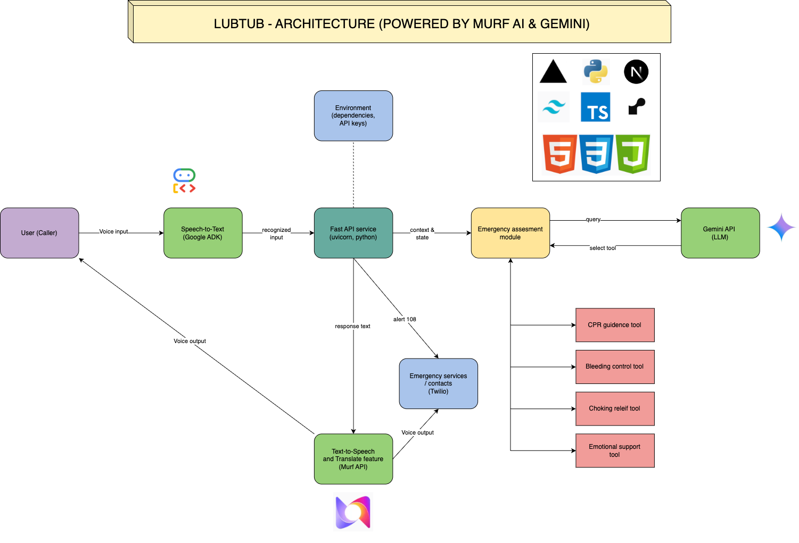

# LubTub AI - Emergency Response Assistant

**Murf Coding Challenge 3 Submission**

[](https://lubtub.onrender.com)
[](https://nextjs.org/)
[](https://murf.ai)

## 🚨 Project Overview

**LubTub AI** is an intelligent emergency response assistant designed to provide immediate guidance and support during critical situations. Built with cutting-edge AI technology, it offers real-time emergency assessment, step-by-step instructions, and emotional support when every second counts.

### 🎯 Key Features

- **🆘 Emergency Assessment**: Rapid evaluation of emergency situations
- **📋 Step-by-Step Guidance**: Clear, actionable instructions for various emergencies
- **🎤 Voice Interaction**: Natural voice input and output for hands-free operation
- **💬 Real-time Chat**: Instant communication with AI assistant
- **📞 Emergency Contact Integration**: Direct emergency service connections
- **❤️ Emotional Support**: Compassionate guidance during stressful situations
- **🔊 Text-to-Speech**: Natural voice responses powered by Murf AI

### 🛠️ Technology Stack

- **Frontend**: Next.js, React, TypeScript, Tailwind CSS
- **Backend**: FastAPI, Python, Google ADK (Agent Development Kit)
- **AI**: Google Gemini API, Murf AI Text-to-Speech
- **Communication**: WebSockets, Real-time audio streaming
- **Deployment**: Render (Backend), Vercel (Frontend)

## 👥 Developed By

**Team Members:**
- **Merlyn Natasha Michelle - Backend**
- **Solaimuthu - frontend**

**For:** Murf Coding Challenge 3 Submission

## 🚀 Live Demo

- **Application**: [https://lubtub.vercel.app]

## 🏗️ Architecture



### Frontend (Next.js)
- Modern, responsive UI with professional design
- Real-time WebSocket communication
- Voice recording and playback capabilities
- Emergency-focused user experience

### Backend (FastAPI + Google ADK)
- Intelligent emergency response system
- Real-time audio processing
- Integration with emergency services
- Comprehensive emergency assessment tools

### AI Integration
- **Google ADK**: Advanced AI agent for emergency response
- **Murf AI**: High-quality text-to-speech synthesis
- **Gemini API**: Natural language understanding and generation

## 🎨 Design Philosophy

Our design focuses on:
- **Accessibility**: Easy-to-use interface for emergency situations
- **Reliability**: Robust, always-available service
- **Compassion**: Supportive, non-judgmental assistance
- **Speed**: Rapid response times when seconds matter
- **Clarity**: Clear, actionable guidance

## 🔧 Getting Started

### Prerequisites
- Node.js 18+
- Python 3.10+
- Google API Key
- Murf AI API Key

### Frontend Setup
```bash
npm install
npm run dev
```

### Backend Setup
```bash
cd backend
pip install -r requirements.txt
uvicorn app.main:app --reload --port 8000
```

## 📱 Usage

1. **Access the Application**: Visit the deployed URL
2. **Describe Emergency**: Type or speak your emergency situation
3. **Receive Guidance**: Get immediate, step-by-step instructions
4. **Follow Instructions**: Execute the provided emergency procedures
5. **Get Support**: Receive emotional support and additional guidance

## 🎯 Emergency Scenarios Supported

- Cardiac emergencies (CPR guidance)
- Bleeding control
- Choking relief
- Unconscious person assessment
- Seizure management
- Accident response
- Emotional crisis support

## 🔒 Security & Privacy

- Secure WebSocket connections (WSS)
- HTTPS encryption for all communications
- No personal data storage
- Emergency-focused data handling

## 📄 License

This project is developed for the Murf Coding Challenge 3 submission.

## 🤝 Contributing

This is a submission for Murf Coding Challenge 3. For questions or feedback, please contact the development team.

---

**Built with ❤️ for emergency response and community safety**
